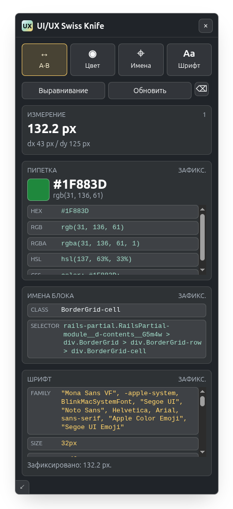

# UI/UX Swiss Knife

Chrome-расширение для ручной проверки интерфейса прямо на странице. Измеряет расстояния, считывает цвет пикселя, показывает DOM-идентификаторы элемента и вычисленные параметры типографики.

<p align="center">
  
</p>

## Возможности

- **Измерение расстояния**: линия A-B показывает расстояние в CSS-пикселях, а также `dx` и `dy`.
- **Привязка угла**: режим выравнивания фиксирует измерение по шагам 45 градусов.
- **Пипетка**: выбирает цвет из видимой области вкладки и показывает значения в `HEX`, `RGB`, `RGBA`, `HSL` и CSS-формате.
- **Имена элемента**: собирает доступные `id`, `class`, `data-*`, `aria-label`, `name`, `role`, CSS selector и runtime-подсказки React/Vue/Angular, если они доступны на странице.
- **Типографика**: показывает `font-family`, размер, line-height, weight, style, letter-spacing, color и готовый CSS `font` shorthand.
- **Копирование**: значения в списках копируются кликом.

## Установка

### Из исходников

1. Откройте `chrome://extensions`.
2. Включите `Developer mode`.
3. Нажмите `Load unpacked`.
4. Выберите корневую папку репозитория.
5. Откройте страницу, которую нужно проверить, и нажмите иконку расширения.

### Из архива

Соберите zip:

```bash
npm run pack:extension
```

Архив появится в `dist/`. Внутри архива `manifest.json` находится в корне.

## Управление

- Выберите режим на панели: `A-B`, `Цвет`, `Имена` или `Шрифт`.
- В режиме `A-B` зажмите кнопку мыши в начальной точке, протяните линию и отпустите.
- В режимах `Имена` и `Шрифт` наведите курсор на нужный элемент и кликните по нему.
- В режиме `Цвет` нажмите `Обновить`, если страница изменилась после снимка видимой области.
- Нажмите `Esc`, чтобы скрыть панель. Повторный клик по иконке расширения снова откроет инструмент.
- Потяните ручку в левом нижнем углу панели, чтобы изменить размер интерфейса.

## Ограничения

- Пипетка работает по снимку видимой области вкладки. После прокрутки, анимаций или изменения страницы нужно обновить снимок.
- Расширение показывает только данные, доступные из DOM и runtime-окружения страницы. Оно не может восстановить имена переменных из исходного кода проекта.
- На `chrome://` страницах и локальных `file://` страницах Chrome может ограничивать работу расширений.

## Разработка

Проверка синтаксиса:

```bash
npm run check
```

Тесты:

```bash
npm test
```

Сборка архива:

```bash
npm run pack:extension
```

Для ручной проверки можно открыть `demo/test-page.html` в браузере и включить расширение на этой странице.

## Релизы

CI запускается на каждый push в `main` и на pull request. Он проверяет синтаксис, запускает тесты, собирает zip и сохраняет его как артефакт GitHub Actions.

Релиз создается пушем git-тега. Перед тегом обновите `version` в `manifest.json` и `package.json`, затем проверьте соответствие:

```bash
npm run release:check -- v1.0
git tag v1.0
git push origin v1.0
```

Релизный workflow повторно запускает проверки, собирает zip, создает GitHub Release и прикладывает архив. Changelog формируется из сообщений коммитов между предыдущим тегом и новым тегом.

## Лицензия

Проект распространяется по лицензии Apache-2.0. Подробности в [LICENSE](LICENSE).
